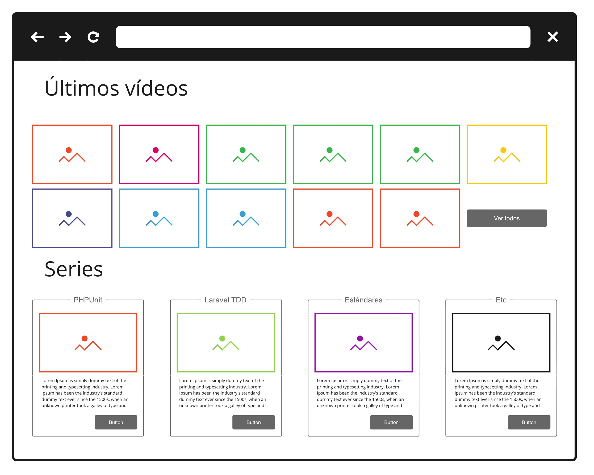
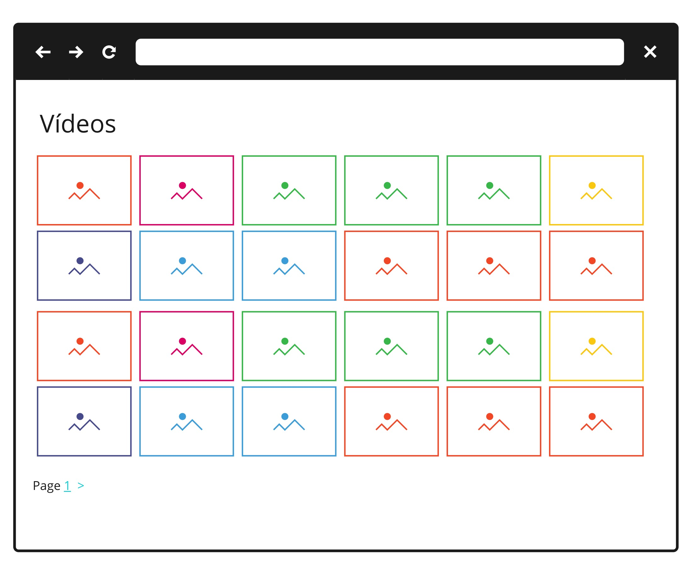
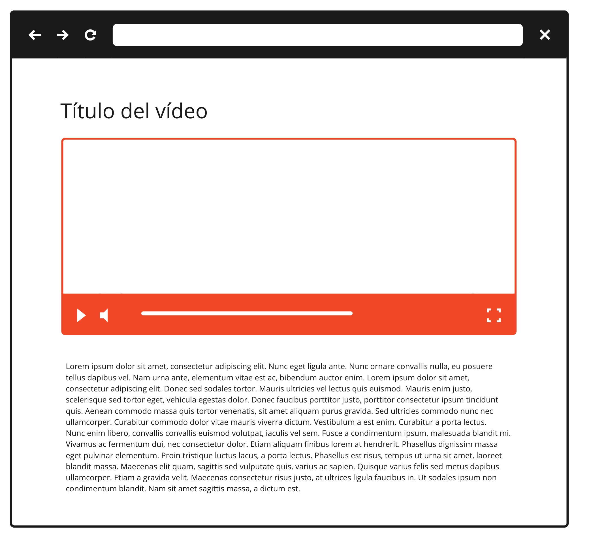
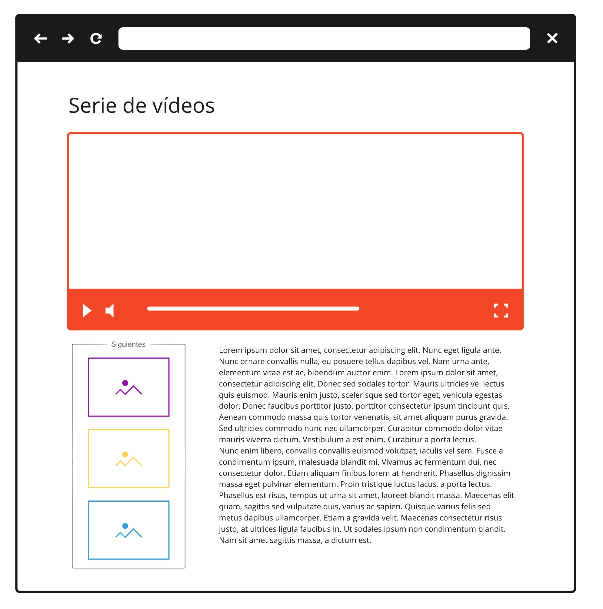

# ZeroToMasters Api


Este repositorio alberga la API de la web [zerotomasters.com](http://zerotomasteres.com)

## API

A pesar de que la web todavía no tiene un diseño final, los siguientes mocks representan de forma sencilla las pantallas a las que la API tiene que dar soporte

### Página inicial



#### Ver todos los vídeos



### Ver un vídeo



### Ver un vídeo de un curso



## Instalar el proyecto

Ejecuta el siguiente comando para descargar el contenido del repositorio

```
git clone https://github.com/zeroToMasters/laravel-api
```

Una vez descargado, accede a la carpeta donde se ha descargado el projecto.

```
cd laravel-api
```
Una vez dentro de la carpeta, necesitas instalar todas las dependencias. Ejecuta el siguiente comando:

```
composer install
```

Una vez que composer termine de descargar todas las dependencias, ya puedes ejecutar la suite de tests con el siguiente comando:

```
vendor/bin/phpunit
```

Si todo ha funcionado como debería, obtendras un mensaje al final del output que dice OK y el numero de tests que han funcionado.

